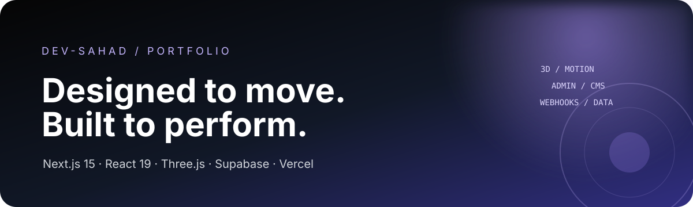
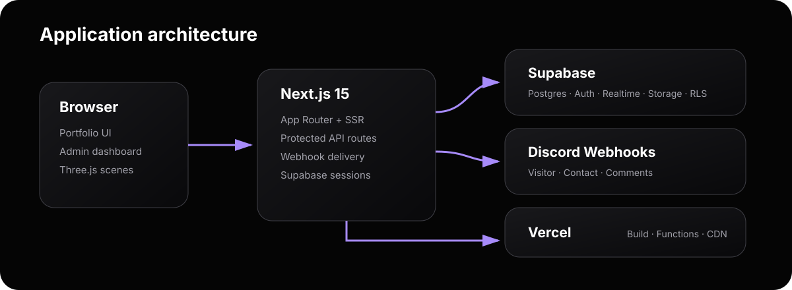

<a id="top"></a>

<p align="center">
  
</p>

<p align="center">
  <a href="https://sahad.is-a.dev/"></a>
  
  
  
  
</p>

<p align="center">
  A cinematic, data-driven developer portfolio with interactive 3D scenes, an authenticated content dashboard, live comments, project case studies, analytics, and separate Discord notification channels.
</p>

## Live application

| Surface | URL | Purpose |
| --- | --- | --- |
| Portfolio | [sahad.is-a.dev](https://sahad.is-a.dev/) | Public portfolio, projects, notes, contact, and comments |
| Notes | [sahad.is-a.dev/blog](https://sahad.is-a.dev/blog) | Published technical notes and case studies |
| Admin | [sahad.is-a.dev/admin](https://sahad.is-a.dev/admin) | Protected content and operations dashboard |

## Highlights

- Mouse-reactive Three.js intro, hero scene, particles, and editable 3D word cloud
- Responsive portfolio with project search, filters, certificates, and technology galleries
- Dynamic project case studies and an MD-style notes section
- Supabase-backed comments with likes, images, pinned posts, replies, and realtime updates
- Protected admin dashboard for projects, certificates, comments, technologies, 3D content, site settings, growth tools, and webhooks
- Separate Discord webhooks for visitors, contact submissions, and comments
- Contact delivery that treats Discord as primary and Gmail as an optional background channel
- PostgreSQL Row Level Security, explicit Data API grants, server-only service-role operations, and revision history
- Vercel production hosting with analytics, speed insights, custom domain, and preview deployments

## Architecture

<p align="center">
  
</p>

The browser renders the public portfolio and authenticated admin tools. Next.js handles server rendering, protected API routes, sessions, analytics, and webhook delivery. Supabase provides Postgres, Auth, Realtime, Storage, and RLS. Vercel builds and serves the application globally.

## Technology

| Area | Stack |
| --- | --- |
| Framework | Next.js 15 App Router, React 19, TypeScript |
| Styling | Tailwind CSS 3, responsive glass UI |
| Motion | Framer Motion, GSAP |
| 3D | Three.js, React Three Fiber, Drei, Rapier |
| Backend | Next.js Route Handlers, Nodemailer |
| Data | Supabase Postgres, Auth, Realtime, Storage, RLS |
| Observability | Vercel Analytics, Speed Insights, application analytics events |
| Delivery | Vercel, GitHub Actions, CodeQL, custom `is-a.dev` domain |

## Project structure

```text
Portfolio/
├── public/
│   ├── readme-banner.svg          # README hero artwork
│   ├── readme-architecture.svg    # Architecture diagram
│   └── ...                        # Portfolio images, icons, CV, and static assets
├── scripts/
│   ├── supabase-portfolio-schema.sql  # Complete SQL Editor setup
│   ├── admin-auth-hardening.sql
│   ├── portfolio-growth-features.sql
│   ├── expand-site-settings.sql
│   ├── expand-webhook-settings.sql
│   └── import-github-projects.*   # GitHub project import utilities
├── src/
│   ├── app/
│   │   ├── api/
│   │   │   ├── admin/             # Authenticated admin APIs
│   │   │   ├── analytics/         # Event ingestion
│   │   │   ├── contact/           # Contact persistence + Discord/Gmail
│   │   │   ├── notify-comment/    # Comments Discord delivery
│   │   │   └── visitors/          # Deduplicated visitor notifications
│   │   ├── admin/
│   │   │   ├── dashboard/         # Content and activity overview
│   │   │   ├── projects/          # Project CRUD and case studies
│   │   │   ├── certificates/      # Certificate management
│   │   │   ├── comments/          # Moderation, pinning, likes, replies
│   │   │   ├── growth/            # Posts, testimonials, inbox, analytics
│   │   │   ├── scene3d/           # Editable hero word cloud
│   │   │   ├── settings/          # Site and visual settings
│   │   │   └── webhook/           # Visitor/contact/comments webhooks
│   │   ├── blog/[slug]/            # Dynamic note pages
│   │   ├── portfolio/[id]/         # Dynamic project pages
│   │   ├── PageClient.tsx          # Public-page orchestration
│   │   ├── layout.tsx
│   │   └── page.tsx
│   ├── components/
│   │   ├── sections/               # Hero, about, work, notes, contact
│   │   ├── ui/                     # Navbar and shared controls
│   │   ├── AnimatedBackground.tsx
│   │   └── WelcomeScreen.tsx
│   ├── hooks/                      # Comments and portfolio data hooks
│   ├── lib/                        # Supabase, settings, webhooks, services
│   ├── utils/supabase/             # Browser/server session clients
│   └── middleware.ts               # Admin authentication boundary
├── .env.example
├── next.config.js
├── tailwind.config.js
├── tsconfig.json
└── vercel.json
```

## Application routes

Public routes:

- `/` — portfolio home
- `/blog` and `/blog/[slug]` — notes
- `/portfolio/[id]` — project case study

Admin routes:

- `/admin/dashboard`
- `/admin/projects` and `/admin/projects/[id]`
- `/admin/certificates`
- `/admin/comments`
- `/admin/technologies` and `/admin/tech`
- `/admin/scene3d`
- `/admin/growth`
- `/admin/settings`
- `/admin/webhook`
- `/admin/status`

Server APIs include `/api/contact`, `/api/notify-comment`, `/api/visitors`, `/api/analytics`, `/api/admin/*`, and protected import/setup utilities.

## Database

The production Supabase schema uses these application tables:

| Table | Responsibility | Public access |
| --- | --- | --- |
| `projects` | Portfolio projects and case-study content | Read |
| `certificates` | Credentials and certificate media | Read |
| `comments` | Guestbook posts, likes, replies, moderation | Read, create, like |
| `technologies` | Technology gallery | Read |
| `tech_stack` | Tech-stack cards and logos | Read |
| `scene3d_words` | Editable 3D hero words | Read |
| `posts` | Published notes | Published rows only |
| `testimonials` | Approved testimonials | Approved rows only |
| `site_settings` | Public portfolio and visual settings | Read |
| `webhook_settings` | Private webhook URLs and templates | Server only |
| `contact_messages` | Contact inbox | Server only |
| `analytics_events` | Product analytics | Server only |
| `content_revisions` | Admin audit and restore snapshots | Server only |

### Apply the SQL Editor schema

The complete, repeatable setup is in [`scripts/supabase-portfolio-schema.sql`](./scripts/supabase-portfolio-schema.sql). It creates missing tables, indexes, RLS policies, explicit grants, realtime publication entries, Storage buckets, upload policies, and the initial 3D word set.

1. Open the Supabase project.
2. Go to **SQL Editor → New query**.
3. Paste the file contents.
4. Run the query once. It is idempotent and can be rerun safely.
5. Review **Database → Advisors** after schema changes.

Never place the service-role key or webhook URLs in client code.

## Local development

Requirements:

- Node.js 20 or newer
- npm
- A Supabase project

```bash
git clone https://github.com/Dev-Sahad/Portfolio.git
cd Portfolio
npm install --legacy-peer-deps
Copy-Item .env.example .env.local
npm run dev
```

Open [http://localhost:3000](http://localhost:3000).

For macOS or Linux, replace the PowerShell copy command with:

```bash
cp .env.example .env.local
```

## Environment variables

| Variable | Exposure | Purpose |
| --- | --- | --- |
| `NEXT_PUBLIC_SUPABASE_URL` | Browser + server | Supabase project URL |
| `NEXT_PUBLIC_SUPABASE_ANON_KEY` | Browser + server | Public Data API key protected by RLS |
| `SUPABASE_SERVICE_ROLE_KEY` | Server only | Admin APIs and private settings |
| `ADMIN_EMAIL` | Server only | Comma-separated admin email allowlist |
| `ADMIN_USER_ID` | Server only | Optional fixed Supabase Auth user ID |
| `GITHUB_TOKEN` | Server only | GitHub project importer |
| `DISCORD_WEBHOOK_URL` | Server only | Visitor webhook fallback |
| `CONTACT_DISCORD_WEBHOOK_URL` | Server only | Contact webhook fallback |
| `COMMENTS_DISCORD_WEBHOOK_URL` | Server only | Comments webhook fallback |
| `GMAIL_USER` / `GMAIL_PASSWORD` | Server only | Optional Gmail delivery |
| `CONTACT_TO_EMAIL` | Server only | Optional contact recipient |

Admin webhook values stored in `webhook_settings` override the environment fallbacks.

## Commands

```bash
npm run dev      # Start the development server
npm run build    # Compile, lint, type-check, and generate production output
npm run start    # Start the production server
npm run lint     # Run ESLint
```

## Security model

- `/admin/*` is protected by Supabase session middleware and verified server-side admin checks.
- Private writes use the server-only service-role client where appropriate.
- Public tables have RLS enabled and receive only the grants required by the UI.
- Webhook URLs stay in a private table or server environment variables.
- Discord payloads disable mentions and webhook URLs are validated before delivery.
- Contact and comment delivery paths use separate webhooks.
- CodeQL runs on the repository and Vercel builds every preview before production.

## Deployment

Merges to `main` are deployed to Vercel. A production build runs:

```bash
npm install --legacy-peer-deps
npm run build
```

The custom production domain is [sahad.is-a.dev](https://sahad.is-a.dev/).

### Custom Domain Setup (is-a.dev)

*The custom domain sahad.is-a.dev was registered via the* ***is-a.dev*** *service:*

1. **Claimed from** [](https://github.com/is-a-dev)
2. **Registered via:** [](https://github.com/is-a-dev/register)
3. **Connected to Vercel:** Added custom domain in Vercel project settings.
4. **DNS Configuration:** *is-a.dev* automatically handles DNS routing to Vercel's edge network

#### Steps Taken:

- Forked/submitted domain claim to [](https://github.com/is-a-dev/register/fork)
- Added domain in **Vercel Dashboard** → Project Settings → Domains
- Vercel provided DNS records; is-a.dev registry integrated them automatically
- Domain now routes all traffic to Vercel deployment

## Author

<div align="center">
  <a href="https://sahad.is-a.dev/">
    
  </a>

  <p>
    Frontend Developer and UI enthusiast focused on crafting accessible,
    responsive, and memorable digital experiences.
  </p>

  <a href="https://sahad.is-a.dev/">
    
  </a>
  <a href="https://github.com/Dev-Sahad">
    
  </a>
  <a href="https://www.linkedin.com/in/muhammad-sahad-78b827352">
    
  </a>
  <a href="https://discord.com/users/853166408212807701">
    
  </a>
  <a href="https://instagram.com/sahad_____sha">
    
  </a>
  <a href="https://t.me/Sxhd_Sha">
    
  </a>
</div>

---

<div align="center">
  <h3>Thank You for Visiting!</h3>
  <p>
    Thank you for exploring this project. If it inspired you or helped you
    build something better, consider leaving a ⭐ — your support means a lot.
  </p>
  <p>
    Built with passion by <a href="https://github.com/Dev-Sahad"><strong>Muhammad Sahad</strong></a>.
  </p>
  <a href="#top">
    
  </a>
</div>
